Federal District Courts and Race-Based Criminal Sentencing Disparities
================
Laurie Baker, Helen Grundman, Lily Khadjavi, Saeja Kim, Momin Malik,
Ariana Mendible, Omayra Ortega, José Pabón, Chad M. Topaz, Thomas
Wakefield
October 01, 2023

- [1 Acknowledgments](#1-acknowledgments)
- [2 Introduction](#2-introduction)
- [3 Background](#3-background)
  - [3.1 Motivation](#31-motivation)
  - [3.2 The U.S. federal court system](#32-the-us-federal-court-system)
  - [3.3 How federal sentencing works](#33-how-federal-sentencing-works)
  - [3.4 Introduction to the data](#34-introduction-to-the-data)
    - [3.4.1 Variable explanation](#341-variable-explanation)
- [4 Data exploration](#4-data-exploration)
  - [4.1 Reading in the data](#41-reading-in-the-data)
  - [4.2 Structure of the data](#42-structure-of-the-data)
  - [4.3 Data Types](#43-data-types)
  - [4.4 Explorations](#44-explorations)
  - [4.5 How to make a scatter plot with quantitative
    variables](#45-how-to-make-a-scatter-plot-with-quantitative-variables)
  - [4.6 What happens when you try to make a scatter plot with
    categorical
    variables?](#46-what-happens-when-you-try-to-make-a-scatter-plot-with-categorical-variables)
  - [4.7 What happens when you try to make a scatterplot with two
    catergoical
    variables?](#47-what-happens-when-you-try-to-make-a-scatterplot-with-two-catergoical-variables)
- [5 Explanatory Data Analysis](#5-explanatory-data-analysis)
  - [5.0.1 What](#501-what)
  - [5.0.2 When](#502-when)
  - [5.0.3 Where](#503-where)
- [6 Statiscal Modeling Approach](#6-statiscal-modeling-approach)
  - [6.1 How to make a scatter plot with quantitative
    variables](#61-how-to-make-a-scatter-plot-with-quantitative-variables)
  - [6.2 What happens when you try to make a scatter plot with
    categorical
    variables?](#62-what-happens-when-you-try-to-make-a-scatter-plot-with-categorical-variables)
  - [6.3 Fitting Lines to Data](#63-fitting-lines-to-data)
    - [6.3.1 Analytically Fit a Line to Two
      Points](#631-analytically-fit-a-line-to-two-points)
    - [6.3.2 Numerically Fit a Line to Two
      Points](#632-numerically-fit-a-line-to-two-points)
    - [6.3.3 Numerically Fit a Line to Three
      Points](#633-numerically-fit-a-line-to-three-points)
  - [6.4 Fitting a Line to Many Points: Linear
    Regression!](#64-fitting-a-line-to-many-points-linear-regression)
  - [6.5 Categorical Data to Numerical
    Representations](#65-categorical-data-to-numerical-representations)
- [7 Results](#7-results)

------------------------------------------------------------------------

This work is governed under the [Creative Commons
Attribution-NonCommercial-ShareAlike 4.0 International
license](https://creativecommons.org/licenses/by-nc-sa/4.0/).

Citation: Laurie Baker, Helen Grundman, Lily Khadjavi, Saeja Kim, Momin
Malik, Ariana Mendible, Omayra Ortega, José Pabón, Chad M. Topaz, Thomas
Wakefield, and Institute for the Quantitative Study of Inclusion,
Diversity, and Equity (QSIDE), 2023.

------------------------------------------------------------------------

# 1 Acknowledgments

This project started at the Institute for Computational and Experimental
Research on Mathematics (ICERM) as part of the week-long workshop
“Educating at the Intersection of Data Science and Social Justice,”
organized by Ron Buckmire, Drew Lewis, Omayra Ortega, Katharine Ott, and
Matt Salamone. This workshop was part of a summer program on “Data
Science and Social Justice: Networks, Policy, and Education,” organized
by Carrie Diaz Eaton, Joseph Hibdon, Drew Lewis, Jessica Libertini,
Omayra Ortega, Victor Piercey, Björn Sandstede, Talitha Washington, Tian
An Wong, and Heather Zinn Brooks.

# 2 Introduction

Welcome to a case study within the Data4Justice curriculum developed by
the [Institute for the Quantitative Study of Inclusion, Diversity, and
Equity (QSIDE)](http://www.qsideinstitute.org). This case study is
designed to help you learn data science skills in a social justice
context. At QSIDE, we hope that our curriculum will be used by anyone
and everyone who is interested in helping to right wrongs by using
quantitative tools. This case study should be accessible to advanced
high school students, to undergraduate students, and to more experienced
academics in any field who would like to learn new skills and ideas.
QSIDE also envisions our case study being used by individuals working in
industry, government, and the nonprofit sphere, as well as any hobbyists
and other members of the general public wanting to challenge themselves.
In short, if you are interested and positioned to learn more about the
interface of social justice and data science, this case study is for
you.

If you are a high school teacher, a college or university faculty
member, or serve in any other instructional capacity, consider using
this case study in ways that are appropriate for your audience. Less
experienced audiences might require a step-by-step approach, proceeding
through the case study in a linear manner at a pace that is not rushed.
More experienced audiences could benefit from using the beginning parts
of the case study, and then being challenged to do more open-ended
exploration. The case study could also be used as the basis for a data
hackathon event.

If you are new to data science in R/Rstudio, before you embark on this
case study, we strongly recommend working through the case study on
[Diversity of Artists in Major U.S.
Museums](https://htmlpreview.github.io/?https://github.com/qsideinstitute/Data4Justice-Curriculum/blob/main/Data4Justice-Curriculum-v4.html),
which will provide some familiarity with R fundamentals and with
exploratory data analysis. This current case study can be viewed as a
tool to cement and expand upon the concepts shared in the previous
Diversity of Artists in Major U.S. Museums case study.

This case study assumes that you have access to RStudio, a programming
environment built on the statistical computing language R. If you want
to use RStudio on your own computer, you should first [install
R](https://cran.r-project.org), and then [install
RStudio](https://www.rstudio.com/products/rstudio/download/#download).
Alternatively, you can register for a free account with [Posit
Cloud](https://posit.cloud), an online version of RStudio that you can
access through any standard web browser.

R is a powerful language, made even more powerful by additional free
software packages that enhance its functionality. Regardless of how you
run RStudio, you will need access to the packages below, which are
automatically activated in the code that produces this document. Make
sure you download these packages using the `Packages` tab in RStudio and
run the commands below before proceeding with this case study.

``` r
library(tidyverse)
library(readr)
library(ggridges)
library(tidycensus)
library(palmerpenguins)
library(gridExtra)
```

QSIDE is a 501(c)3 tax-exempt nonprofit organization. Initiatives like
our Data4Justice curriculum require resources to produce, and we depend
on a public that is willing to support social justice initiatives.
Anyone is welcome to use this document for free, but we ask those who
are able to [please make a donation to
QSIDE](https://qsideinstitute.org/support-us/donate/) so that we can
maintain our innovative research, action, and education efforts at the
interface of data science and social justice. Additionally, we ask
anyone using any or all of this document to cite it properly using the
citation above.

Now let’s get to learning!

# 3 Background

Our case study centers around issues of racial disparity in criminal
sentencing, and is based on research performed by one of this case
study’s authors. Before proceeding, take some time to read the original
study, [Federal Criminal Sentencing: Race-Based Disparate Impact and
Differential Treatment in Judicial
Districts](https://www.nature.com/articles/s41599-023-01879-5). There
may be some things in the paper that you don’t understand — perhaps just
a few, or perhaps many. That’s ok. The goal of reading the paper is not
to understand every detail, but rather to provide a first exposure to
the material you’ll be working on and to get you excited about it. For
convenience, here is the abstract.

------------------------------------------------------------------------

**Abstract**

Race-based inequity in federal criminal sentencing is widely
acknowledged, and yet our understanding of it is far from complete.
Inequity may arise from several sources, including direct bias of
courtroom actors and structural bias that produces racially disparate
impacts. Irrespective of these sources, inequity may also originate from
different loci within the federal system. We bring together the
questions of the sources and loci of inequity. The purpose of our study
is to quantify race-based disparate impact and differential treatment at
the national level and at the level of individual federal judicial
districts. We analyze over one-half million sentencing records publicly
available from the United States Sentencing Commission database,
spanning the years 2006 to 2020. At the system-wide level, Black and
Hispanic defendants receive average sentences that are approximately 19
months longer and 5 months longer, respectively. Demographic factors and
sentencing guideline elements account for nearly 17 of the 19 months for
Black defendants and all five of the months for Hispanic defendants,
demonstrating the disparate impact of the system at the national level.
At the individual district level, even after controlling for each
district’s unique demographics and implementation of sentencing factors,
14 districts show significant differences for minoritized defendants as
compared to white ones. These unexplained differences are evidence of
possible differential treatment by judges, prosecutors, and defense
attorneys.

------------------------------------------------------------------------

In this case study, we won’t cover all of the results described in this
paper, but we will cover some of the most important ones. Thinking about
the distinction between observational and experimental case studies,
this case study can be viewed as an observational study because the
researchers are attempting to learn about the population of interest by
sampling and observing patterns without manipulating any variables.

## 3.1 Motivation

What are race-based sentencing disparities, and why should we care?
Race-based sentencing disparities in the United States refer to the
marked and consistent differences in the severity and types of sentences
given to individuals of different racial and ethnic backgrounds,
convicted of the same or similar crimes. This disparity has been a
subject of debate and research for many decades, as part of a broader
discourse on racial bias in the criminal justice system. It has been
consistently found that people of color are more likely to receive
harsher sentences than their white counterparts.

This phenomenon can be traced back to the historical context of the
United States. Racial discrimination and bias have been entrenched in
American society, and the criminal justice system is not immune to these
systemic biases. The War on Drugs in the 1980s and 1990s, for example,
disproportionately impacted communities of color, with crack cocaine
offenses (more common among Black communities) punished far more
severely than powder cocaine offenses (more common among white
communities). This is despite the fact that both substances are
pharmacologically identical.

While legal changes have reduced some explicit forms of discrimination,
research suggests that implicit bias and structural factors continue to
contribute to sentencing disparities. For example, mandatory minimum
sentencing laws can disproportionately impact people of color due to
disparities in the types of crimes committed and the socioeconomic
conditions that can lead to criminal behavior.

From a social justice perspective, race-based sentencing disparities
matter significantly. They reflect and perpetuate racial inequity,
undermining the promise of equal treatment under the law that is a
fundamental principle of democratic societies. They erode public trust
in the legal system, making it more difficult for law enforcement and
the courts to function effectively.

Furthermore, these disparities contribute to the vicious cycle of
systemic racism. Individuals who receive harsher sentences are more
likely to face significant challenges in reintegrating into society
post-incarceration, including limited employment opportunities,
disruptions to family structures, and disenfranchisement. These
challenges can increase the likelihood of recidivism, perpetuating
racial disparities in economic and social outcomes.

The existence of race-based sentencing disparities is a call to action
for policy reform. This may include efforts to reduce mandatory minimum
sentences, increase the use of alternatives to incarceration, provide
bias training for judges and prosecutors, and implement more
transparent, objective sentencing guidelines. Addressing these
disparities is a crucial step toward realizing a more equitable and just
society.

In conclusion, race-based sentencing disparities in the U.S. not only
reflect the systemic racism embedded within the criminal justice system
but also exacerbate social and economic inequalities. Achieving social
justice necessitates a comprehensive and diligent effort to rectify
these disparities, creating a fair, unbiased system that upholds the
tenet of equal treatment for all, regardless of race or ethnicity.
Fixing our biased system can be aided by identifying the loci of racial
inequity, which is the purpose of this case study.

## 3.2 The U.S. federal court system

Before we dive into understanding race-based sentencing disparities in
the United States, let’s understand some important context about the
U.S. federal court system and federal sentencing. The United States
federal court system is, at its core, a three-tiered structure, starting
with district courts at the bottom, circuit courts in the middle, and
the Supreme Court at the top.

The district courts are the workhorses of the federal judiciary,
handling the vast majority of federal cases. There are 94 federal
judicial districts, including one or more districts in each state, as
well as courts for the District of Columbia and Puerto Rico. Three
territories of the United States – the Virgin Islands, Guam, and the
Northern Mariana Islands – have district courts as well.

Above the district courts are the United States courts of appeals. These
courts are divided into 12 regional circuits across America, each of
which hears appeals from the district courts located within its circuit.
There’s also the Court of Appeals for the Federal Circuit, which has
nationwide jurisdiction to hear appeals in specialized cases, such as
those involving patent laws and cases decided by the U.S. Court of
International Trade and the U.S. Court of Federal Claims.

At the pinnacle of the federal court system is the Supreme Court of the
United States, composed of nine justices. The Supreme Court mainly hears
appeals from the circuit courts and state supreme courts, but it also
has original jurisdiction over a small range of cases.

Federal judges, including Supreme Court justices, are nominated by the
President and confirmed by the Senate. They serve “during good
behavior,” which effectively means they can hold their positions for
life. A federal judge may also exit office through voluntary retirement
or resignation.

However, judges can be removed from office before their term ends if
they’re impeached and convicted. Impeachment is a political process,
initiated by the House of Representatives and decided by the Senate.
Impeachment of federal judges has happened 15 times in U.S. history, and
of these, eight judges have been convicted and removed from office.

As of 2021, there were about 677 federal district court judgeships.
These judges deal with a broad range of cases, including those related
to federal laws, disputes between states, and issues involving the
federal government.

## 3.3 How federal sentencing works

In this module, we are considering sentencing patterns, and possible
bias, in criminal cases adjudicated in the federal district courts from
2006–2020. You might wonder what sorts of cases end up in these courts.
The cases are restricted to those that involve federal statutes,
interpretations of the US Constitution, or more than one state.

In criminal cases resulting in a conviction, the crime statute itself
may have sentencing restrictions, but beyond those, a judge has complete
freedom in setting the length of the prison term. We will examine data
at the national level as well as within individual districts, with an
eye for detecting possible racial bias.

In 1987, the United States Sentencing Commission created sentencing
guidelines for Federal Courts. These guidelines prescribe a range of
possible prison terms, taking into account both the severity of the
crime and the prior criminal history of the defendant, as well as
numerous possible mitigating factors (ones that may call for shortening
the sentence) and aggravating factors (ones that may call for
lengthening the sentence). Although these guidelines were initially
mandatory, a 2005 Supreme Court ruling changed them to being only
advisory, returning great freedom in sentencing to each individual
judge.

## 3.4 Introduction to the data

We will analyze the over one-half million sentencing records spanning
the years 2006 to 2020 provided by the U.S. Sentencing Commission.
Publicly available data is usually quite messy, with many missing and
ambiguous entries. For this reason, you will be using a curated copy,
that is, one that has been “cleaned up” (directions for obtaining the
curated copy is in the following section of this module). The sentence
lengths we are using are given in months and do not include probation
nor alternative confinement. Since our aim is to compare lengths of
prison sentences imposed, we have eliminated from the data set any cases
involving non-citizens–those sentences frequently involve deportation,
which is not comparable to prison terms. We combined the information
from some variables (creating new variables) and eliminated incomplete
data items, that is entire records, for defendants for whom we are not
given sufficient information. We have eliminated the (relatively few)
records with sentence lengths of more than 470 months, but retained
those with life sentences, which have been coded by the Commission as
470 months. Finally, because there are very few defendants sentenced in
the district court of the Northern Mariana Islands, those items were
also eliminated.

The data come from two sources: the pre-sentencing report and the
Statement of Reasons. The pre-sentencing report is prepared by the
District’s Probation Office and based on a post-trial, pre-sentencing
investigation including an interview with the defendant. A draft of this
report is issued to the attorneys for comments and corrections and a
final version is given to the attorneys and judge. The Statement of
Reasons is a form filled out by the judge explaining/supporting the
sentence imposed.

### 3.4.1 Variable explanation

The two main variables used in the non-mandatory guidelines for
sentencing are criminal history (`criminal_history`) and an indicator of
the severity of the crime (`all_adjustments`). The two variables are
combined, using a table, to determine the recommended range of the
sentence.

The variable `criminal_history` is coded as a value 1–6, with 1
including a defendant with at most one conviction, where that conviction
resulted in a sentence of less than 60 days. Prior convictions are
assigned “points,” depending on the number of prior convictions,
length(s) of sentence(s), and whether or not past crimes involved
violence. The points are then summed and translated into a “criminal
history category,” represented by the `criminal_history` values 1
through 6. As an additional example, a defendant who has three prior
convictions with sentences of over 13 months and two with sentences
between 2 and 13 months would be assigned a total of 13 points, yielding
the criminal history category 6. With only one prior conviction of each
type, the category would be 3. The calculation is not quite this simple,
with many adjustments and some types of convictions and very old
convictions being ignored.

The variable `all_adjustments` is a rating of the offense level (how
severe the crime is) with adjustments (added considerations that call
for higher or lower offense level), as defined by the US Sentencing
Commission’s Sentencing Guidelines Manual and interpreted by the US
Probation Office and/or the Presiding Judge. There are 43 levels where,
for example, first degree murder has a base level (that is, level prior
to adjustments) of 43 and trespassing has a base level of 4. Two
additional variables, `base_chapter2_adjustments` and
`base_chapter2_3_adjustments`, have to do with the derivation of
`all_adjustments`, but you can ignore these for the purposes of this
case study.

Apart from `criminal_history` and `all_adjustments`, there are several
variables related to identity of defendants:

- `age`, which refers to a defendant’s age in years.
- `sex`, which has been coded as a binary variable 0 and 1, where 0 is
  “Male” and 1 is “Female”. FINISH EXPLAINING HERE.
- `educ`, which refers to a defendant’s educational attainment which
  consists of 4 levels (1 refers to a defendant having less than high
  school graduation, 3 refers to a high school graduate, 5 means having
  some college, and 6 means college graduate), and
- `race`, which refers to a defendant’s race and has levels “black”,
  “hispanic”, “white” and “other”.

A key motivation for this work is exploring how our personal and racial
identities influence the judicial sentencing. In a fair, democratic
system this identity or perceived identity should not affect how we are
treated by the justice system. It is important to note that these
characteristics are not independent of one another but can intersect and
interact with one another. This combined effect is known as
intersectionality. The Center for Intersectional Justice describes the
concept of intersectionality as: “the ways in which systems of
inequality based on gender, race, ethnicity, sexual orientation, gender
identity, disability, class and other forms of discrimination
‘intersect’ to create unique dynamics and effects” (Ref: [Center for
Intersectional
Justice](https://www.intersectionaljustice.org/what-is-intersectionality),
July 20, 2023). `sex` has been coded as a binary variable 0 and 1, where
0 is “Male” and 1 is “Female”.

<!-- **To add**
&#10;- Add how sex was defined (sex is defined in pre-sentencing report that comes out of the investigation done by the probation office. This goes to the attorneys and also comes out of an interview with the individual. It should be noted that there are only two categories, so it is likely that there might be only two options possible). See Background section or link to official report for more information.
- Discuss how a binary variable will not reflect sentenced individuals gender identity and excludes several groups. It is also limiting in nature.
- Discuss difference between sex and gender
- Discuss who has defined this variable and why this is problematic
- Discuss the limitations and how this affects the analysis and inferences we can make.
- Update sex label with more appropriate label based on Background research. -->

The nine other variables in the dataset refer to information about the
court cases themselves:

- `year`, which describes the year in which the court case took place,
- `sentence_length`, the length prescribed to a defendant in months,
- `guilty_plea`, where 0 means the defendant did not plead guilty and 1
  means the defendant did plead guilty, <!-- check this! -->
- `grid_cell`,
- `mandatory_min`,
- `gov_departures`, and
- `district`, which refers to the district where the trial took place.

# 4 Data exploration

Alright, let’s start digging into the data. Whenever you are handed a
new data set, you want to read in the data so you can view it in RStudio
and perform an Exploratory Data Analysis (EDA).

## 4.1 Reading in the data

You can read in your data using `read_csv()` and creating a variable
named `us_sent` that refers to the data set.

``` r
us_sent <- read_csv("data/cleaned_data_renamed.csv")
```

    ## Rows: 518719 Columns: 15
    ## ── Column specification ────────────────────────────────────────────────────────
    ## Delimiter: ","
    ## chr  (3): grid_cell, district, race
    ## dbl (10): sentence_length, age, sex, educ, year, guilty_plea, base_chapter2_...
    ## lgl  (2): mandatory_min, gov_departures
    ## 
    ## ℹ Use `spec()` to retrieve the full column specification for this data.
    ## ℹ Specify the column types or set `show_col_types = FALSE` to quiet this message.

To view the data in a new tab within RStudio, you can use the `View()`
function. Because this is an interactive RStudio function that doesn’t
work when we knit the document, we have set up our document so that the
code can be viewed below but not actually run when we knit
(specifically, we used the code chunk option `eval = FALSE`).

``` r
View(us_sent)
```

## 4.2 Structure of the data

As you may remember, in a tidy data set, each row is an observation,
each column is a variable, and each cell is a value. In the case of the
federal criminal sentencing data, each row represents an individual who
was sentenced in the federal district court system in the U.S. in one of
the country’s 94 districts.

When we start exploring a data set, we will want to think about some key
questions using the four W’s: who, what, when, and where. Specifically,
you might ask: who is in our data set? What was the sentence? When was
the individual was sentenced? Where did the sentence occur?

Can you guess which variables pertain to each question? Let’s inspect
our variables, which are in the columns, and see if that helps. There
are several functions we can use to do this:

- `names()` will provide the names of the columns in the data set

  ``` r
  names(us_sent)
  ```

      ##  [1] "sentence_length"             "age"                        
      ##  [3] "sex"                         "educ"                       
      ##  [5] "year"                        "guilty_plea"                
      ##  [7] "base_chapter2_adjustments"   "base_chapter2_3_adjustments"
      ##  [9] "all_adjustments"             "grid_cell"                  
      ## [11] "mandatory_min"               "gov_departures"             
      ## [13] "district"                    "race"                       
      ## [15] "criminal_history"

- `summary()` will provide the names of the columns in the data set
  along with a brief numeric or qualitative summary of each variable

  ``` r
  summary(us_sent)
  ```

      ##  sentence_length       age             sex              educ      
      ##  Min.   :  0.00   Min.   :16.00   Min.   :0.0000   Min.   :1.000  
      ##  1st Qu.: 12.03   1st Qu.:28.00   1st Qu.:0.0000   1st Qu.:1.000  
      ##  Median : 41.00   Median :35.00   Median :0.0000   Median :3.000  
      ##  Mean   : 62.96   Mean   :36.96   Mean   :0.1681   Mean   :3.101  
      ##  3rd Qu.: 87.00   3rd Qu.:44.00   3rd Qu.:0.0000   3rd Qu.:5.000  
      ##  Max.   :470.00   Max.   :97.00   Max.   :1.0000   Max.   :6.000  
      ##       year       guilty_plea     base_chapter2_adjustments
      ##  Min.   :2006   Min.   :0.0000   Min.   :-8.00            
      ##  1st Qu.:2009   1st Qu.:0.0000   1st Qu.:16.00            
      ##  Median :2013   Median :0.0000   Median :24.00            
      ##  Mean   :2013   Mean   :0.0454   Mean   :23.21            
      ##  3rd Qu.:2017   3rd Qu.:0.0000   3rd Qu.:30.00            
      ##  Max.   :2020   Max.   :1.0000   Max.   :53.00            
      ##  base_chapter2_3_adjustments all_adjustments  grid_cell         mandatory_min  
      ##  Min.   : 1.00               Min.   : 1.00   Length:518719      Mode :logical  
      ##  1st Qu.:16.00               1st Qu.:14.00   Class :character   FALSE:453517   
      ##  Median :24.00               Median :21.00   Mode  :character   TRUE :65202    
      ##  Mean   :23.52               Mean   :21.31                                     
      ##  3rd Qu.:30.00               3rd Qu.:28.00                                     
      ##  Max.   :64.00               Max.   :43.00                                     
      ##  gov_departures    district             race           criminal_history
      ##  Mode :logical   Length:518719      Length:518719      Min.   :1.000   
      ##  FALSE:417903    Class :character   Class :character   1st Qu.:1.000   
      ##  TRUE :100816    Mode  :character   Mode  :character   Median :2.000   
      ##                                                        Mean   :2.655   
      ##                                                        3rd Qu.:4.000   
      ##                                                        Max.   :6.000

- `str()` will display (sometimes complex) details of the internal
  structure of the R object, including the table dimensions, variable
  names, variable types, and the first 10 observations for each variable
  within a data table

  ``` r
  str(us_sent)
  ```

      ## spc_tbl_ [518,719 × 15] (S3: spec_tbl_df/tbl_df/tbl/data.frame)
      ##  $ sentence_length            : num [1:518719] 0.46 90 65 87 60 62 84 120 53 0 ...
      ##  $ age                        : num [1:518719] 36 21 35 26 30 23 29 26 45 36 ...
      ##  $ sex                        : num [1:518719] 0 0 0 0 0 0 0 0 0 1 ...
      ##  $ educ                       : num [1:518719] 3 3 1 1 3 5 1 3 3 3 ...
      ##  $ year                       : num [1:518719] 2006 2006 2006 2006 2006 ...
      ##  $ guilty_plea                : num [1:518719] 0 0 0 0 0 0 0 0 0 0 ...
      ##  $ base_chapter2_adjustments  : num [1:518719] 38 18 28 32 28 28 28 14 20 20 ...
      ##  $ base_chapter2_3_adjustments: num [1:518719] 38 18 28 32 28 28 26 14 20 20 ...
      ##  $ all_adjustments            : num [1:518719] 35 15 25 29 26 25 23 34 17 17 ...
      ##  $ grid_cell                  : chr [1:518719] "XFOLSOR35XCRHISSR5" "XFOLSOR15XCRHISSR4" "XFOLSOR25XCRHISSR2" "XFOLSOR29XCRHISSR3" ...
      ##  $ mandatory_min              : logi [1:518719] FALSE TRUE FALSE FALSE FALSE TRUE ...
      ##  $ gov_departures             : logi [1:518719] TRUE FALSE FALSE FALSE FALSE FALSE ...
      ##  $ district                   : chr [1:518719] "Dist of Columbia" "Dist of Columbia" "Dist of Columbia" "Dist of Columbia" ...
      ##  $ race                       : chr [1:518719] "white" "black" "black" "black" ...
      ##  $ criminal_history           : num [1:518719] 5 4 2 3 5 1 5 6 4 1 ...
      ##  - attr(*, "spec")=
      ##   .. cols(
      ##   ..   sentence_length = col_double(),
      ##   ..   age = col_double(),
      ##   ..   sex = col_double(),
      ##   ..   educ = col_double(),
      ##   ..   year = col_double(),
      ##   ..   guilty_plea = col_double(),
      ##   ..   base_chapter2_adjustments = col_double(),
      ##   ..   base_chapter2_3_adjustments = col_double(),
      ##   ..   all_adjustments = col_double(),
      ##   ..   grid_cell = col_character(),
      ##   ..   mandatory_min = col_logical(),
      ##   ..   gov_departures = col_logical(),
      ##   ..   district = col_character(),
      ##   ..   race = col_character(),
      ##   ..   criminal_history = col_double()
      ##   .. )
      ##  - attr(*, "problems")=<externalptr>

- `glimpse()` is a simplified version of `str()` that only displays the
  dimensions, variable names, variable types, and the first set of
  observations for each variable within a data table (how many
  observations depends on the width of your output)

  ``` r
  glimpse(us_sent)
  ```

      ## Rows: 518,719
      ## Columns: 15
      ## $ sentence_length             <dbl> 0.46, 90.00, 65.00, 87.00, 60.00, 62.00, 8…
      ## $ age                         <dbl> 36, 21, 35, 26, 30, 23, 29, 26, 45, 36, 44…
      ## $ sex                         <dbl> 0, 0, 0, 0, 0, 0, 0, 0, 0, 1, 0, 0, 0, 0, …
      ## $ educ                        <dbl> 3, 3, 1, 1, 3, 5, 1, 3, 3, 3, 3, 5, 1, 3, …
      ## $ year                        <dbl> 2006, 2006, 2006, 2006, 2006, 2006, 2006, …
      ## $ guilty_plea                 <dbl> 0, 0, 0, 0, 0, 0, 0, 0, 0, 0, 0, 0, 0, 0, …
      ## $ base_chapter2_adjustments   <dbl> 38, 18, 28, 32, 28, 28, 28, 14, 20, 20, 30…
      ## $ base_chapter2_3_adjustments <dbl> 38, 18, 28, 32, 28, 28, 26, 14, 20, 20, 30…
      ## $ all_adjustments             <dbl> 35, 15, 25, 29, 26, 25, 23, 34, 17, 17, 27…
      ## $ grid_cell                   <chr> "XFOLSOR35XCRHISSR5", "XFOLSOR15XCRHISSR4"…
      ## $ mandatory_min               <lgl> FALSE, TRUE, FALSE, FALSE, FALSE, TRUE, FA…
      ## $ gov_departures              <lgl> TRUE, FALSE, FALSE, FALSE, FALSE, FALSE, F…
      ## $ district                    <chr> "Dist of Columbia", "Dist of Columbia", "D…
      ## $ race                        <chr> "white", "black", "black", "black", "black…
      ## $ criminal_history            <dbl> 5, 4, 2, 3, 5, 1, 5, 6, 4, 1, 1, 1, 2, 1, …

> Note: You can use the built in R help documentation to learn more
> about each function by typing a question mark followed by the name of
> the function in the console, e.g. `?str()`

## 4.3 Data Types

What is halfway between 0 and 1? It is 1/2. What is halfway between
horse and dog? There is no such thing! Thinking about each type of data
is very important so that we don’t code silly things like the mean of
animal species.

There are two main types of data: **categorical data** and **numerical
data**. Some examples of categorical data would be color, ethnicity,
employment status, or states/countries. These have unique values, like
California or Oregon. In other words, categorical variables take on
discrete, finite values.

On the other hand, numerical data is in number form. Some examples of
numerical data are temperature, height, and salary. It makes perfect
sense to be 165.8 cm tall or for the temperature to be 82.4 degrees
outside.

There are some confusing data types that use numbers to *represent*
categorical data, like zip code. You may live in the zip code 90201,
which is a number, but you can’t live in the zip code 90210.3. Only
whole numbers, and specific ones at that, make sense here. We will learn
more about using numbers to represent categorical data in this lesson.

Can you identify which data type each variable in the federal criminal
sentencing data is?

## 4.4 Explorations

A good practice to do with a new data set is to explore it through
visualization. We will walk through a few graphs in R so you can see how
to plot. We will examine each of these so we can see relationships and
learn more about our data. Then, explore on your own by modifying this
code!

## 4.5 How to make a scatter plot with quantitative variables

In this first plot, we will look at numerical variables only using a
scatter plot. Scatter plots help us to visualize and understand
numerical data better. We will compare each defendant’s age to their
sentence length through visualization and observation, and we will use
this scatter plot to identify any patterns that exist in our data set.
Each dot in the scatter plot we produce with the `ggplot()` command from
the **ggplot2** package represents a row in our `us_sent` data.

To use `ggplot()`, we start by indicating what data set we want to plot,
`us_sent`. Then, we sepcify what our variables of interest are–in this
case, we are interested in `age` and `sentence_length`. `geom_point()`
specifies that we are interested in using a scatter plot to represent
our data. There are many fun and useful modifications that change the
way a scatter plot looks. For example, you can change the color of data
points using `color`, you can change the size of data points using
`size`, and you can specify the transparency of data points using
`alpha`. It’s also good practice to come up with a useful title and good
axis labels using the `labs` command.

``` r
ggplot(us_sent, aes(x = age, 
                    y = sentence_length)) + 
  geom_point(color = 'coral2',
             size = 0.5,
             alpha = 0.4) +
  labs(title = "Sentence Length by Age",
       x = "Age (Years)",
       y = "Sentence Length (Months)")
```

<!-- -->

What do you notice in this scatter plot? What do you wonder?

## 4.6 What happens when you try to make a scatter plot with categorical variables?

We just created a scatter plot with two numerical variables. Now we will
see what happens if one variable is numerical and the other is
categorical. Run the code below that plots `criminal_history` (a
categorical variable) against `age` (a numerical variable).

``` r
ggplot(us_sent, aes(x = age, 
                    y = criminal_history)) + 
  geom_point(color = 'coral2', 
             alpha = 0.7) +
  labs(title = "Criminal History by Age",
       x = "Age (Years)",
       y = "Criminal History (1-6 levels)") # come back to this
```

<!-- -->

What do you notice in this scatter plot? What do you wonder?

## 4.7 What happens when you try to make a scatterplot with two catergoical variables?

Let’s try one more scenario. What happens when you try to plot two
categorical variables against each other? Run the code below to plot sex
against species (both categorical variables).

``` r
us_sent1 <- us_sent %>% 
  mutate(sex = as.factor(sex)) ## COME BACK TO THIS

ggplot(us_sent1, aes(x = race,
                    y = sex)) + 
  geom_point(color = 'coral2', 
             alpha = 0.7) +
  labs(title = "Race by Sex",
       x = "Race",
       y = "Sex (Male or Female)")
```

<!-- -->

What do you notice in this scatter plot? What do you wonder?

As you may have noted, scatter plots of two categorical variables are
not that useful for analysis and inference since they only display the
way we’ve grouped our data and not any of the underlying patterns. To
compare two categorical variables frequency tables or bar graphs are a
better visualization to use. In the remainder of this lesson we will
focus on comparisons where we have *at least one numerical variable*.

# 5 Explanatory Data Analysis

<!-- - explain the different columns (linking to the background) -->

Now, let’s return to exploring the variables of interest. Remember, we
want to know *who* is in our data set, *what* the sentence was, *when*
the individual was sentenced and *where* the sentence occurred. Did you
identify some of the variables that might correspond with each of these
questions? You might have classified the variables as follows:

<!-- https://www.nature.com/articles/s41599-023-01879-5 -->

| Who                | What              | When   | Where      |
|:-------------------|:------------------|:-------|:-----------|
| `age`              | `sentence_length` | `year` | `district` |
| `sex`              | `mandatory_min`   |        |            |
| `educ`             |                   |        |            |
| `race`             |                   |        |            |
| `criminal_history` |                   |        |            |
| `guilty_plea`      |                   |        |            |

#### 5.0.0.1 Sex

Remember that `sex` has been coded as a binary variable 0 and 1, where 0
is “Male” and 1 is “Female”. We can confirm this using `distinct()`, a
function that displays all unique values under a specified column.

``` r
us_sent %>%
  distinct(sex)
```

    ## # A tibble: 2 × 1
    ##     sex
    ##   <dbl>
    ## 1     0
    ## 2     1

We can recode this variable using `mutate` and `case_when`, so that we
simply see the words “Male” and “Female”, rather than the coded numbers.
Let’s also use `ggplot()` to view the distribution of `sex` within our
data set, this time using `geom_bar()` to display the data in a bar
graph. Another difference from when we made a scatter plot above using
`geom_point()` is that we are adding `fill` to make sure the bars in the
bar graph are colored in. We can also add `scale_fill_viridis_d()` to
automatically apply a certain color scheme to our plot.

``` r
us_sent %>%
  mutate(sex = case_when(sex == 0 ~ "Male",
                         sex == 1 ~ "Female")) %>%
  ggplot() +
  geom_bar(aes(x = sex, fill = sex)) +
  labs(x = "Sex*",
       title = "Sex* of Sentenced Individuals",
       y = "Number of Individuals",
       fill = "Sex*") +
  scale_fill_viridis_d()
```

<!-- -->

From this graph, we can see that there are far more males than females
in our data set.

#### 5.0.0.2 Race

Let’s continue exploring through turning toward the `race` variable. We
will start our exploration of `race` by using `distinct`.

``` r
us_sent %>%
  distinct(race)
```

    ## # A tibble: 4 × 1
    ##   race    
    ##   <chr>   
    ## 1 white   
    ## 2 black   
    ## 3 other   
    ## 4 hispanic

We can once again use `ggplot()` to make a bar graph displaying the
`race` variable. We can make use of `fct_infreq()` when choosing `race`
as our x variable, which makes sure the bars in the plot are ordered by
largest to smallest from left to right.

``` r
us_sent %>%
  mutate(race = case_when(race == "other" ~ "ari",
                         TRUE ~ race)) %>%
  ggplot() +
  geom_bar(aes(x = fct_infreq(race), fill = race)) +
  labs(x = "Race*",
       title = "Race* of Sentenced Individuals",
       y = "Number of Individuals",
       fill = "Race*") +
  scale_fill_viridis_d()
```

<!-- -->

#### 5.0.0.3 Race and Sex

Now let’s look at how `race` and `sex` relate to one another. First,
let’s look at the number of people in each combination using `count`
again.

``` r
us_sent %>%
  mutate(sex = case_when(sex == 0 ~ "Male",
                         sex == 1 ~ "Female")) %>% 
  count(race, sex)
```

    ## # A tibble: 8 × 3
    ##   race     sex         n
    ##   <chr>    <chr>   <int>
    ## 1 black    Female  23500
    ## 2 black    Male   160152
    ## 3 hispanic Female  18603
    ## 4 hispanic Male    85305
    ## 5 other    Female   5654
    ## 6 other    Male    22036
    ## 7 white    Female  39452
    ## 8 white    Male   164017

We can represent these two variables using a bar graph. Once again we
will use `ggplot` to create this plot. This time, since we are creating
a bar graph displaying two different variables, we can define `race` as
the x variable and have the colors of the bar graph correspond to the
`sex` variable.

``` r
us_sent %>%
  mutate(race = case_when(race == "other" ~ "ari",
                         TRUE ~ race)) %>%
  mutate(sex = case_when(sex == 0 ~ "Male",
                         sex == 1 ~ "Female")) %>%
  ggplot() +
  geom_bar(aes(x = fct_infreq(race), fill = sex)) +
  labs(x = "Race*",
       title = "Race* and Sex* of Sentenced Individuals",
       y = "Number of Individuals",
       fill = "Sex*")  +
  scale_fill_viridis_d()
```

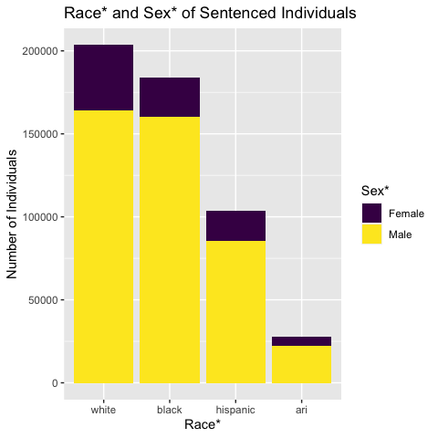<!-- -->

We can also create a proportional bar plot. All we need to add to our
previous `ggplot()` is `position = "fill"` within `geom_bar()`.

``` r
us_sent %>%
  mutate(race = case_when(race == "other" ~ "ari",
                         TRUE ~ race)) %>%
  mutate(sex = case_when(sex == 0 ~ "Male",
                         sex == 1 ~ "Female")) %>%
  ggplot() +
  geom_bar(aes(x = fct_infreq(race), fill = sex), position = "fill") +
  labs(x = "Race*",
       title = "Race* and Sex* of Sentenced Individuals",
       y = "Number of Individuals",
       fill = "Sex*")  +
  scale_fill_viridis_d()
```

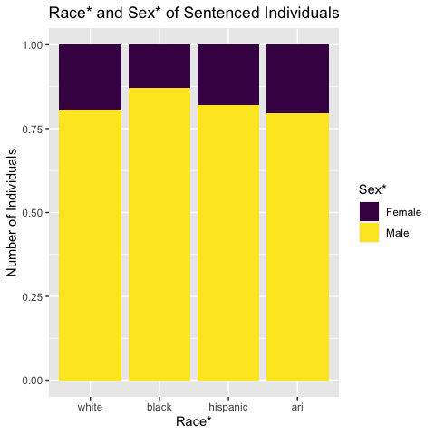<!-- -->

#### 5.0.0.4 Age

We might want to explore what the age of different individuals is across
districts. Let’s explore the districts of Maine, Rhode Island, and
Vermont. We can use the `filter` command to look at only these three
districts of interest.

``` r
us_sent %>%
  filter(district %in% c("Maine", "Rhode Island", "Vermont"))
```

    ## # A tibble: 5,257 × 15
    ##    sentence_length   age   sex  educ  year guilty_plea base_chapter2_adjustments
    ##              <dbl> <dbl> <dbl> <dbl> <dbl>       <dbl>                     <dbl>
    ##  1              10    28     0     1  2006           0                        13
    ##  2              18    20     0     3  2006           0                        18
    ##  3             184    22     0     1  2006           0                        25
    ##  4              44    37     0     3  2006           0                        16
    ##  5              42    27     0     5  2006           0                        20
    ##  6             210    45     0     5  2006           1                        32
    ##  7             108    27     0     3  2006           0                        31
    ##  8             130    22     0     1  2006           0                        23
    ##  9               0    38     0     6  2006           0                        10
    ## 10              19    27     0     3  2006           0                        16
    ## # ℹ 5,247 more rows
    ## # ℹ 8 more variables: base_chapter2_3_adjustments <dbl>, all_adjustments <dbl>,
    ## #   grid_cell <chr>, mandatory_min <lgl>, gov_departures <lgl>, district <chr>,
    ## #   race <chr>, criminal_history <dbl>

**To add**: - what do we divide by? - You may look at this plot and say
that whites are sentenced at the federal district court more than black
individuals. This is where it is important to look at the population in
each district.

**Future Directions**

Bringing in the spatial district files

- <https://www.openicpsr.org/openicpsr/project/100069/version/V1/view>
- Downloading census data from the API.
- Joining to census data
- Limitations of census data
- Other potential things to mention (the affect of aggregation and
  spatial scale).

### 5.0.1 What

Moving on to answering the “What?” question about our data. You might
have guessed that `sentence_length` and `mandatory_min` are the
variables that fall under this category.

#### 5.0.1.1 How does sentence length correlate with criminal history?

Sentence lengths and how do they relate to policy?

When we are exploring the distribution of a data set can we can use a
number of different plots. To better understand sentence length data,
we’ll display a histogram for this quantitative variable. A histogram
gives us a visual representation of the frequency of values. With R, we
can change the width of each bin or choose a number of bins, and then
the plot shows us how many sentences fell within each bin range.

##### 5.0.1.1.1 Histogram

``` r
ggplot(us_sent) +
  geom_histogram(aes(x = sentence_length), binwidth = 12) +
  labs(x = "Sentence length in months", y = "Number of individuals")  +
  geom_vline(aes(xintercept = 12), color = "red", linetype = 2) +
  geom_vline(aes(xintercept = 60), color = "red", linetype = 2) +
  geom_vline(aes(xintercept = 120), color = "red", linetype = 2) +
  geom_vline(aes(xintercept = 240), color = "red", linetype = 2)
```

<!-- -->

##### 5.0.1.1.2 Histogram

``` r
ggplot(us_sent) +
  geom_histogram(aes(x = sentence_length/12), binwidth = 1) +
  labs(x = "Sentence length in years", y = "Number of individuals") +
  geom_vline(aes(xintercept = 1), color = "red", linetype = 2) +
  geom_vline(aes(xintercept = 5), color = "red", linetype = 2) +
  geom_vline(aes(xintercept = 10), color = "red", linetype = 2) +
  geom_vline(aes(xintercept = 20), color = "red", linetype = 2) +
  labs(title = "Distribution of number of individuals by ")
```

<!-- -->

We observe a high frequency over 0, meaning that many individuals who
are convicted may in fact receive a sentence of 0 months. At the other
extreme, we see cases corresponding to 470 months, representing
individuals who either have been given a long sentence, meaning 39 years
or possibly a life sentence.

$$could further discuss skew, peaks and relate to sentencing table,
etc.$$

##### 5.0.1.1.3 Violin Plot

Violin plots are another way of showing the distribution data.

``` r
ggplot(us_sent) +
  geom_violin(aes(x = as.factor(criminal_history), 
                  y = sentence_length, 
                  fill = as.factor(criminal_history))) +
  labs(fill = "Criminal History", 
       y = "Sentence length in months", 
       x = "Criminal History")
```

<!-- -->

##### 5.0.1.1.4 Ridge plot

``` r
ggplot(us_sent) +
  geom_density_ridges(aes(y = as.factor(criminal_history),
                          x = sentence_length,
                          fill = as.factor(criminal_history))) +
  labs(title = "Distribution of sentence length in months by criminal history",
       subtitle = "Black dashed lines indicate 1, 5, 10, 15, and 20 year sentences",
       fill = "Criminal History",
       x = "Sentence length in months",
       y = "Criminal History") +
  geom_vline(aes(xintercept = 12), color = "black", linetype = 2) +
  geom_vline(aes(xintercept = 60), color = "black", linetype = 2) +
  geom_vline(aes(xintercept = 120), color = "black", linetype = 2) +
  geom_vline(aes(xintercept = 180), color = "black", linetype = 2) +
  geom_vline(aes(xintercept = 240), color = "black", linetype = 2) +
  scale_fill_viridis_d()
```

    ## Picking joint bandwidth of 5.47

<!-- -->

#### 5.0.1.2 What is the relationship between `all_adjustments` and `sentence_length`?

``` r
ggplot(us_sent) +
  geom_point(aes(y = sentence_length,
                 x = all_adjustments, color = as.factor(criminal_history)), alpha = 0.01) +
  labs(x = "All Adjustments",
       y = "Sentence length in months",
       color = "Criminal History") +
  facet_wrap(~ race) +
  scale_color_viridis_d()
```

<!-- -->

``` r
ggplot(us_sent) +
  geom_point(aes(y = sentence_length,
                 x = all_adjustments, color = as.factor(criminal_history)), alpha = 0.01) +
  labs(x = "All Adjustments",
       y = "Sentence length in months",
       color = "Criminal History") +
  scale_color_viridis_d()
```

<!-- -->

#### 5.0.1.3 How does the age range vary with criminal history?

``` r
ggplot(us_sent) +
  geom_density_ridges(aes(y = as.factor(criminal_history),
                          x = age,
                          fill = as.factor(criminal_history))) +
  labs(fill = "Criminal History",
       x = "Age of individual in years",
       y = "Criminal History")
```

    ## Picking joint bandwidth of 0.989

<!-- -->

### 5.0.2 When

Let’s explore the time data found in our US sentencing data set. How
many columns of data did we have again? This seems like a good place to
start digging into what kind of time data we have in this data set.
Which tool can we use to find out?

Do we remember?

We do remember; we can use the `names()` routine to remind ourselves.

``` r
names(us_sent)
```

    ##  [1] "sentence_length"             "age"                        
    ##  [3] "sex"                         "educ"                       
    ##  [5] "year"                        "guilty_plea"                
    ##  [7] "base_chapter2_adjustments"   "base_chapter2_3_adjustments"
    ##  [9] "all_adjustments"             "grid_cell"                  
    ## [11] "mandatory_min"               "gov_departures"             
    ## [13] "district"                    "race"                       
    ## [15] "criminal_history"

We can see the fifteen column names in that output. Awesome. Looks like
our time data, as far as ‘when’ these convicted individuals in our data
were convicted, is in the `year` column. Let’s see what we’re working
with here. Let’s use the pipe `distinct()` routine again.

``` r
us_sent %>% distinct(year)
```

    ## # A tibble: 15 × 1
    ##     year
    ##    <dbl>
    ##  1  2006
    ##  2  2007
    ##  3  2008
    ##  4  2009
    ##  5  2010
    ##  6  2011
    ##  7  2012
    ##  8  2013
    ##  9  2014
    ## 10  2015
    ## 11  2016
    ## 12  2017
    ## 13  2018
    ## 14  2019
    ## 15  2020

Excellent. So we have years from 2006 to 2020 in our data, or 15 rows
worth of data. It is worth noticing that although 2020-2006 = 14, when
we count each year as a whole year of data ‘inclusively’, we have 15
distinct instances, which the distinct command helpfully listed out for
us.

Now each of these data points is a numeric variable, such as ‘2010’, or
‘2015’. One way we could check is to use the `sapply()` routine.

``` r
sapply(us_sent, is.numeric)
```

    ##             sentence_length                         age 
    ##                        TRUE                        TRUE 
    ##                         sex                        educ 
    ##                        TRUE                        TRUE 
    ##                        year                 guilty_plea 
    ##                        TRUE                        TRUE 
    ##   base_chapter2_adjustments base_chapter2_3_adjustments 
    ##                        TRUE                        TRUE 
    ##             all_adjustments                   grid_cell 
    ##                        TRUE                       FALSE 
    ##               mandatory_min              gov_departures 
    ##                       FALSE                       FALSE 
    ##                    district                        race 
    ##                       FALSE                       FALSE 
    ##            criminal_history 
    ##                        TRUE

In the output we can indeed see `TRUE` for the column `year`. As we
progress in our educational journey, learn about different numeric
variables, including double precision floating point arithmetic numeric
variables. Is our `year` data in this format? Let’s use the same command
with a different argument:

``` r
sapply(us_sent, is.double)
```

    ##             sentence_length                         age 
    ##                        TRUE                        TRUE 
    ##                         sex                        educ 
    ##                        TRUE                        TRUE 
    ##                        year                 guilty_plea 
    ##                        TRUE                        TRUE 
    ##   base_chapter2_adjustments base_chapter2_3_adjustments 
    ##                        TRUE                        TRUE 
    ##             all_adjustments                   grid_cell 
    ##                        TRUE                       FALSE 
    ##               mandatory_min              gov_departures 
    ##                       FALSE                       FALSE 
    ##                    district                        race 
    ##                       FALSE                       FALSE 
    ##            criminal_history 
    ##                        TRUE

Nice, we can see that our `year` data is indeed a double precision
floating point number.

Let’s do a graph of our `year` data, where we have each year on the
vertical (y) axis and the sentences on the horizontal (x) axis.

``` r
ggplot(us_sent) +
  geom_bar(aes(y = year))
```

<!-- -->

If we wanted to use a scatter plot, which could be a bit ‘messier’, one
way to do so would be:

``` r
ggplot(us_sent, aes(x = sentence_length, 
                    y = year)) + 
  geom_point()
```

<!-- -->

### 5.0.3 Where

Let’s check what districts we have in the data. We can do this using
`distinct(district)`.

``` r
us_sent %>%
  distinct(district)
```

    ## # A tibble: 93 × 1
    ##    district        
    ##    <chr>           
    ##  1 Dist of Columbia
    ##  2 Maine           
    ##  3 Massachusetts   
    ##  4 New Hampshire   
    ##  5 Puerto Rico     
    ##  6 Rhode Island    
    ##  7 Connecticut     
    ##  8 New York East   
    ##  9 New York North  
    ## 10 New York South  
    ## # ℹ 83 more rows

You’ll notice that certain states are a single district on their own.
Other larger states are split into several districts (e.g. New York
East, New York North).

Q: If you live in the United States, can you identify which district you
live in?

**To Do** Add a link to a reference where someone could also find which
district their town/city is in.

We can use `distinct` to figure out what distinct districts we have in
our data set, but we are also interested in finding out how many
sentences were made in each district and we will want to think about
this question in relation to the population of those districts, which
can be quite nuanced and we will come back to this later.

Our goals in this next section are to think about ways we can explore
the question “Where did those sentences occur?” in a visual way.

**Learning aims**

- introduce factors as a data type
- explain why it might be better to put our names on the y axis instead
  of the x-axis for many categories and those with longer names. This
  makes it more readable.
- explain that automatically categorical data will be placed in
  alphabetical order.
- we can reconfigure the graph using functions from the `forcats`
  package.
- This is a good example for when you might want to order it in terms of
  frequency (i.e. the count) using `fct_infreq`
- We may also want to reverse the order to see the districts which have
  the most sentences at the top of our plot using `fct_rev`.

#### 5.0.3.1 Number of individuals sentences across districts

##### 5.0.3.1.1 Base Bar Plot

``` r
ggplot(us_sent) +
  geom_bar(aes(x = district))
```

<!-- -->

##### 5.0.3.1.2 District on the y-axis

``` r
ggplot(us_sent) +
  geom_bar(aes(y = district))
```

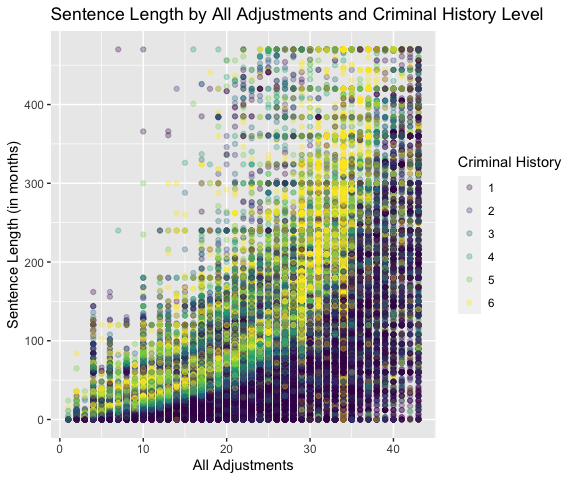<!-- -->

##### 5.0.3.1.3 Ordered by number of sentences

``` r
ggplot(us_sent) +
  geom_bar(aes(y = fct_infreq(district)))
```

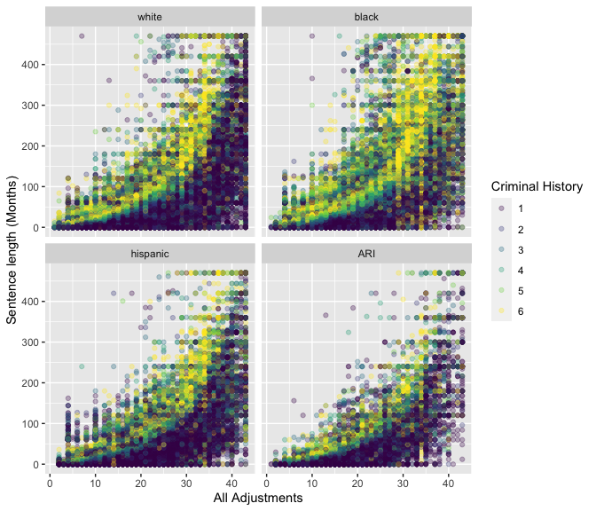<!-- -->

##### 5.0.3.1.4 Ordering from high to low

``` r
ggplot(us_sent) +
  geom_bar(aes(y = fct_rev(fct_infreq(district))))
```

<!-- -->

##### 5.0.3.1.5 Add title and axes labels

``` r
ggplot(us_sent) +
  geom_bar(aes(y = fct_rev(fct_infreq(district)))) +
  labs(title = "Number of individuals sentenced at the federal district court level for each district from x to x",
       y = "Federal District Court",
       x = "Number of individuals")
```

<!-- -->

##### 5.0.3.1.6 Making the plot more readable with subsetting

``` r
ggplot(us_sent) +
  geom_bar(aes(y = fct_rev(fct_infreq(district)))) +
  labs(title = "Number of individuals sentenced at the federal district court level for each district from x to x",
       y = "Federal District Court",
       x = "Number of individuals")
```

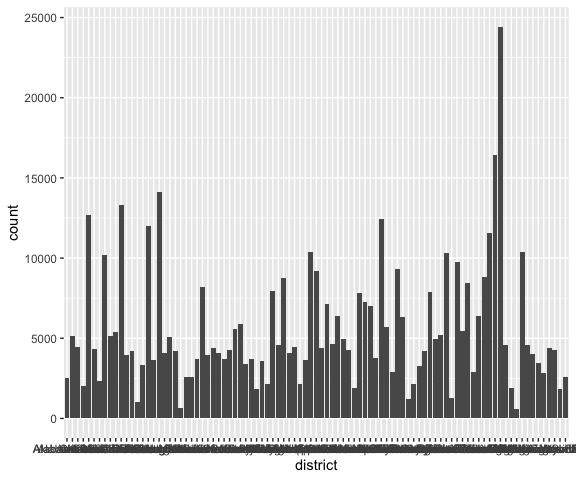<!-- -->

``` r
ggplot(us_sent) +
  geom_bar(aes(y = fct_infreq(district))) +
  labs(title = "Number of individuals sentenced at the federal district court level for each district from x to x",
       y = "Federal District Court",
       x = "Number of individuals")
```

<!-- -->

##### 5.0.3.1.7 Exploring the census data

**To Do**:

- If we want to get out the district populations, we will probably need
  to download the data by the county level.
- Decision points: we could download the data in categories by age and
  sex and race: e.g. 5-9, 10-14 etc. This might get a little

``` r
# apply unique census api key
census_api_key("5177724b01a7fe4714097e711cb95230c37cfce7", overwrite = TRUE)

# import census data
## guide to spatial units: https://api.census.gov/data/2016/acs/acs5/geography.html
## variable of interest --> population
## vars <- load_variables(year = 2013,
                      # data set = "acs5",
                      # cache = TRUE)

# B02001_001: Total
# B03002_003: White alone (Not Hispanic or Latino)
# B03002_004 Black or African American alone (Not Hispanic or Latino)
# B03002_012: Hispanic or Latino
# B03002_005: Native American alone (Not Hispanic or Latino)
# B03002_006: Asian alone (Not Hispanic or Latino)
# B03002_007: Native Hawaiian or Pacific Islander alone (Not Hispanic or Latino)
# B03002_009: Multiple Races (Not Hispanic or Latino)
# B03002_008: Other (Not Hispanic or Latino)

#census_place_df <- get_acs(geography = "state", variables = c("B01003_001E"), geometry = TRUE, year = 2010)
```

# 6 Statiscal Modeling Approach

## 6.1 How to make a scatter plot with quantitative variables

In this first plot, we will look at numerical variables only. We will
see how each penguin’s flipper length relates to its body mass.

Each dot in the scatter plot we produce with the ggplot command
represents a row in our penguin data. Scatter plots help us to visualize
and understand numerical data better. We will compare each penguin’s
body mass to their flipper length through visualization and observation.
We will use this scatterplot to identify any patterns that exist in our
penguin data set.

%%%%%%%%% come back to this to explain R code %%%%%%%%%%%

``` r
ggplot(penguins, aes(x=body_mass_g, y=flipper_length_mm)) + geom_point(color='coral2', alpha=0.7)
```

    ## Warning: Removed 2 rows containing missing values (`geom_point()`).

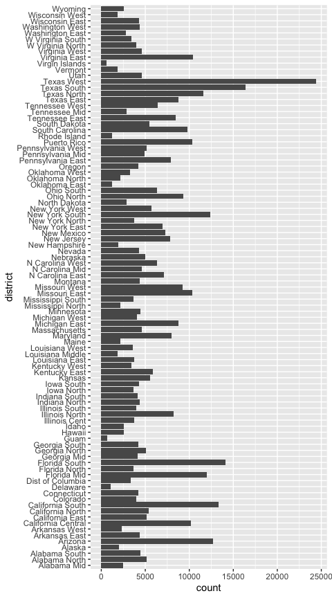<!-- -->

What do you notice in this scatter plot? What do you wonder?

## 6.2 What happens when you try to make a scatter plot with categorical variables?

We just created a scatter plot with two numerical variables. Now we will
see what happens if one variable is numerical and the other is
categorical? Run the code below that plots species (a categorical
variable) against flipper length (a numerical variable).

``` r
ggplot(penguins, aes(x=species, y=flipper_length_mm)) + geom_point(color='coral2', alpha=0.7)
```

    ## Warning: Removed 2 rows containing missing values (`geom_point()`).

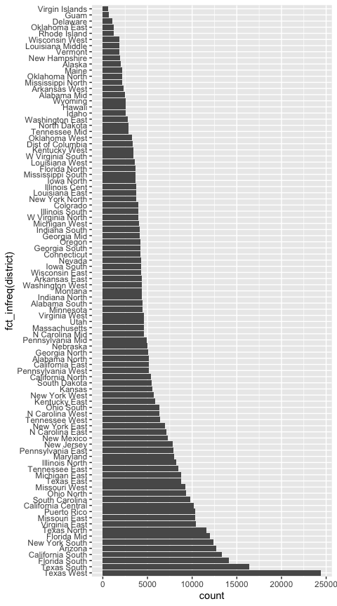<!-- -->

What do you notice in this scatter plot? What do you wonder?

Let’s try one more scenario. What happens when you try to plot two
categorical variables against each other? Run the code below to plot sex
against species (both categorical variables).

``` r
ggplot(penguins, aes(x=species, y=sex)) + geom_point(color='coral2', alpha=0.7)
```

<!-- -->

What do you notice in this scatter plot? What do you wonder?

Scatter plots of two categorical variables are not that useful for
analysis and inference since they only display the way we’ve grouped our
data and not any of the underlying patterns. To compare two categorical
variables frequency tables or bar graphs are a better visualization to
use. In the remainder of this lesson we will focus on comparisons where
we have *at least one numerical variable*.

## 6.3 Fitting Lines to Data

Suppose we want to predict how much electricity the city of Los Angeles,
California will use based on the daily temperature. As the temperature
goes higher, more people will turn on their air conditioners and use
more electricity. We can look at past electricity use data and compare
it to the temperature each day to get a sense of how these two
attributes are related. Knowing and understanding how two variables
relate can help you plan for future possibilities or identify and
correct patterns that you don’t want to continue. For example, we can
use this relationship to makes predictions of how much electricity Los
Angeles will use in the future if we know the future temperature, and
make sure that there is enough for the city’s needs.

Let’s make two example points, point A at (1,2) and point B at (3,5). In
R, we will save this into a data frame using a vector of the x values, 1
and 3, and a vector of the matching y values, 2 and 5.

``` r
twopoints <- data.frame(xvals = c(1,3), yvals = c(2,5), label = c('A','B'))
head(twopoints)
```

    ##   xvals yvals label
    ## 1     1     2     A
    ## 2     3     5     B

We can make a fairly simple plot of these two points.

``` r
twoplot <- ggplot(twopoints, aes(x=xvals, y=yvals)) + 
  geom_point(color='coral2') + 
  geom_text(aes(label=label), nudge_y = .3 ) +
  xlim(0,6) + 
  ylim(0,6)
twoplot
```

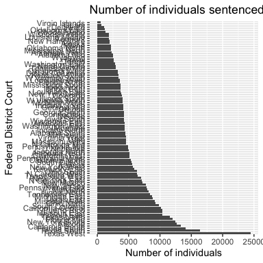<!-- -->

### 6.3.1 Analytically Fit a Line to Two Points

In order to create a linear regression on these two points, we can think
back to algebra and use the formula for a line.

$$ 
y = m x + b
$$

Fitting our line to the data is straightforward, we can solve in a
number of ways. One way, is that we can plug both these points into the
equation of the line and then solve the system together.

$$
2 = (1)m + b 
$$ $$5 = (3)m+b$$Here we have a system that has two equations and two
unknowns, $m$ and $b$. We know this system has a unique solution! Since
we can solve this system using a variety of techniques, try to solve
this system using a technique you are comfortable with and verify that
the solution below passes through each of the two points.

$$
y = \frac{3}{2} x+ \frac{1}{2}
$$

We can plot the results. Here we use the `abline()` function, to plot
our linear equation which can be done by inputting the values for the
slope and the intercept.

``` r
twoplot + geom_abline(slope=3/2, intercept = 1/2)
```

<!-- -->

### 6.3.2 Numerically Fit a Line to Two Points

``` r
twolinear <- lm(formula = yvals ~ xvals, data=twopoints)
twolinear
```

    ## 
    ## Call:
    ## lm(formula = yvals ~ xvals, data = twopoints)
    ## 
    ## Coefficients:
    ## (Intercept)        xvals  
    ##         0.5          1.5

Notice that the line above goes right through our two data points.

We know that two points alone uniquely define a line, but what do we
think will happen if we have to find a line that describes the goes
through three data points? Let’s add the point (2,3) to our exisiting
set and see what happens when try to draw a line through these three
points. Below, we will use R to plot three graphs of our points, each
attempting to find a line that goes through all three data points.

``` r
threepoints = rbind(twopoints, data.frame(xvals = 2, yvals = 3, label='C'))
threepoints$yfit1 = threepoints$xvals*3/2+1/2
threepoints$yfit2 = threepoints$xvals+1
threepoints$yfit3 = threepoints$xvals*2-1

threeplot = ggplot(threepoints, aes(x=xvals, y = yvals)) + 
  geom_point(color = 'coral2')  + 
  geom_text(aes(label=label), nudge_y = 0.3, check_overlap = TRUE) +
  xlim(0,6) + ylim(0,6)

grid.arrange(
  threeplot + geom_abline(slope=3/2, intercept = 1/2) + geom_segment(aes(xend = xvals, yend = yfit1), color='coral2'),
  threeplot + geom_abline(slope=1, intercept = 1) + geom_segment(aes(xend = xvals, yend = yfit2), color='coral2'),
  threeplot + geom_abline(slope=2, intercept = -1) +  geom_segment(aes(xend = xvals, yend = yfit3), color='coral2'),
ncol=3
)
```

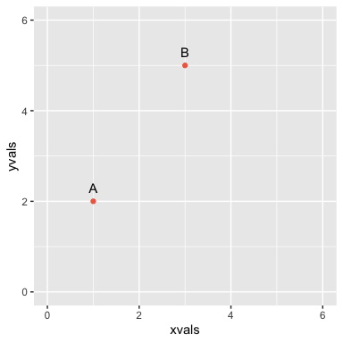<!-- --> Notice in
all three graphs above, we can’t draw a straight line through all three
points at the same time. The best that we can do is try to find a line
that gets very close to all theree points, or fits these three points
the best. But how can we define “the best” line that fits this data?

To understand which line *best fits* our three data points, we need to
talk about the **error**, which is also called the **residual** in
statistics. The residual is the vertical distance between the predicted
data point y (on the line) and the actual value of y our data takes on
at that point (the value we collected) at each of our data points. In
our data set we have the points (1,2), (2,3), and (3,5) so the only
actual values for y in our data set are 2,3, and 5 even though our
prediction line (our model) takes on all values of y between 0 and 6.

### 6.3.3 Numerically Fit a Line to Three Points

To find the model that best fits our data, we want to make the error as
small as possible. Linear regression is a techique that allows us to
identify the line that minimizes our error, this line is called a
*linear regression model* and is the line that best fits our data.
Below, you will see R code to identify the model that best fits our
data.

``` r
threelinear = lm(formula=yvals~xvals, data=threepoints)
threelinear
```

    ## 
    ## Call:
    ## lm(formula = yvals ~ xvals, data = threepoints)
    ## 
    ## Coefficients:
    ## (Intercept)        xvals  
    ##      0.3333       1.5000

``` r
threepoints$linfit = 1.5*threepoints$xvals + 0.3333
ggplot(threepoints, aes(x=xvals, y = yvals)) + 
  geom_point(color='coral2')  + 
  geom_text(aes(label=label), nudge_y = -0.4 ) +
  xlim(0,6) + ylim(0,6)+ 
  geom_abline(slope=1.5, intercept=0.3333) + 
  geom_segment(aes(xend = xvals, yend = linfit), color='coral2')
```

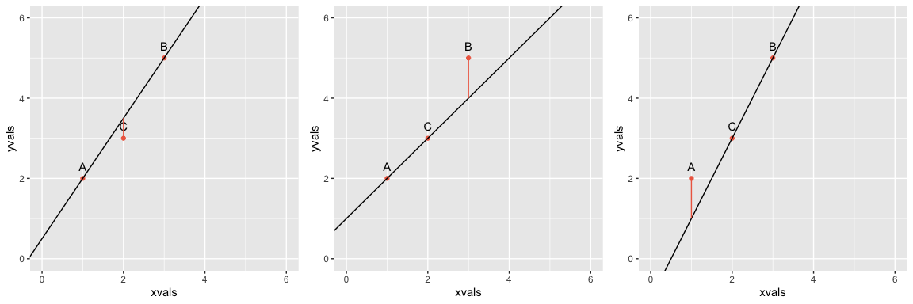<!-- --> Notice that
the best fit linear model doesn’t go through any of our three points!
**Why do you think that is?**

Keep in mind, our goal is to minimize our error as much as we can. In
each of the four previous graphs, the error (or the distance between the
predicted y value and the actual y value) is shown on the graph. Of the
four plots we just made of lines through our three data points, which
looks like it has the smallest error?

## 6.4 Fitting a Line to Many Points: Linear Regression!

Now let’s go back to our penguins data. Do you think a linear model
might be a good way to model the data? Run the code below to create a
scatterplot of flipper length versus body mass.

``` r
pengscat = ggplot(penguins, aes(x=body_mass_g, y=flipper_length_mm)) + 
  geom_point(color='coral2', alpha=0.7)
pengscat
```

    ## Warning: Removed 2 rows containing missing values (`geom_point()`).

<!-- --> Take a look
at the scatterplot, does it look like most of the data fall along a
straight line? If the general shape is a line, then yes, we should try
to model this data with linear regression line.

``` r
pengfit = lm(formula = flipper_length_mm ~ body_mass_g, data = penguins)
pengfit
```

    ## 
    ## Call:
    ## lm(formula = flipper_length_mm ~ body_mass_g, data = penguins)
    ## 
    ## Coefficients:
    ## (Intercept)  body_mass_g  
    ##   136.72956      0.01528

Here R givs us the slope and intercept of the straight line that best
fits our data. Let’s graph this line together with our data using the
code below.

``` r
pengscat + geom_abline(slope= 0.0152, intercept = 137.0396)
```

    ## Warning: Removed 2 rows containing missing values (`geom_point()`).

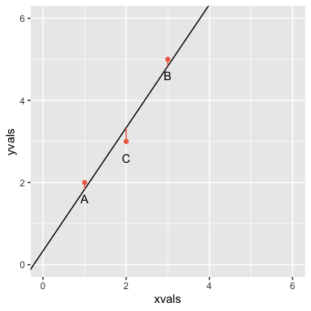<!-- --> - still need
how to evaluate whether we have a good model R^2

## 6.5 Categorical Data to Numerical Representations

So that we can analyze the sentencing data that we looked at earlier, we
will need to explore scatterplots where only on variable is numerical
and the other is categorical. Let’s compare flipper length to penguin
species. Remember that flipper length is a numerical varible and species
is a categorical variable with three levels (Adelie, Chinstrap, and
Gentoo).

To start, let’s consider one level at a time, so we can get a good sense
of what is the relationship between species and flipper length. Below we
examine Adelie penguins first.

``` r
penguins$isAdelie = ifelse(penguins$species=='Adelie', 1, 0)
adelieplot = ggplot(penguins, aes(x=isAdelie, y=flipper_length_mm)) + 
  geom_point(color='coral2', alpha=0.7)
adelieplot
```

    ## Warning: Removed 2 rows containing missing values (`geom_point()`).

<!-- --> Next, we
create a linear model for the relationship between flipper length and
whether a penguin is an Adelie penguin or not.

``` r
amodel = lm(formula = flipper_length_mm~isAdelie, data=penguins)
amodel
```

    ## 
    ## Call:
    ## lm(formula = flipper_length_mm ~ isAdelie, data = penguins)
    ## 
    ## Coefficients:
    ## (Intercept)     isAdelie  
    ##      209.58       -19.63

Then plot this best fit linear model against with our scatterplot to
compare. Do you think that our linear model is a good representation of
the data?

As we saw before, things look a little bit different when we are dealing
with categroical variables. In these types of scatterplots, we would
expect the best fit model to pass through the mean values of each level
of our categorical variable (or each ‘chunk’ of data). See below.

``` r
adelieplot + geom_abline(slope=-19.35, intercept=209.45)
```

    ## Warning: Removed 2 rows containing missing values (`geom_point()`).

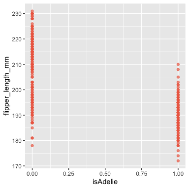<!-- --> Now we do
the same thing for the other two species (Chinstrap and Gentoo) and plot
all three graphs side by side.

``` r
penguins$isChinstrap = ifelse(penguins$species=='Chinstrap',1,0)
penguins$isGentoo = ifelse(penguins$species=='Gentoo',1,0)

cmodel = lm(formula = flipper_length_mm~isChinstrap, data=penguins)
gmodel = lm(formula = flipper_length_mm~isGentoo, data=penguins)

speciesbase = ggplot(penguins, aes(y=flipper_length_mm)) 
aplot = speciesbase + 
  geom_point(aes(x=isAdelie), color='coral2', alpha=0.7) + 
  geom_abline(slope=amodel$coefficients[2], intercept=amodel$coefficients[1])
cplot = speciesbase + 
  geom_point(aes(x=isChinstrap), color='coral2', alpha=0.7) + 
  geom_abline(slope=cmodel$coefficients[2], intercept=cmodel$coefficients[1])
gplot = speciesbase + 
  geom_point(aes(x=isGentoo), color='coral2', alpha=0.7) + 
  geom_abline(slope=gmodel$coefficients[2], intercept=gmodel$coefficients[1])

grid.arrange(aplot, cplot, gplot, ncol=3)
```

    ## Warning: Removed 2 rows containing missing values (`geom_point()`).
    ## Removed 2 rows containing missing values (`geom_point()`).
    ## Removed 2 rows containing missing values (`geom_point()`).

<!-- --> What would
happen if instead of creating linear models for each level of the
categorical variable separately, we created a single linear model for
flipper length versus all species types? The code below allows us to
find that model in just one step.

``` r
linmodel <- lm(flipper_length_mm ~ species, data = penguins)
linmodel
```

    ## 
    ## Call:
    ## lm(formula = flipper_length_mm ~ species, data = penguins)
    ## 
    ## Coefficients:
    ##      (Intercept)  speciesChinstrap     speciesGentoo  
    ##           189.95              5.87             27.23

This model will look like
$$Flipper Length = 190.103 + 5.72*(Chinstrap) + 27.133*(Gentoo)$$ where
the variable Chinstrap is an indicator variable that takes on the value
of 1 when the penguin is the species Chinstrap and takes on the value of
0 when the penguin is any other species. Similarly, the variable Gentoo
is an indicator variable that takes on the value of 1 when the penguin
is the species Gentoo and takes on the value of 0 when the penguin is
any other species.

So…what happened to the Adelie penguins in our model?!?! Notice the
variable for Adelie is missing in our model. It actually got absorbed by
the y-intercept! We only need n-1 variables to represent n levels of a
categorical variable because we have this y-intercept. When a penguin is
of the species Adelie and we apply this linear model, the values for
Gentoo and Chinstrap are both equal to 0, since the penguin is an
Adelie. Thus our model would predict a flipper length of 190.103 for all
Adelie penguins.

What is the flipper length predicted by our model for a Chinstrap
penguin? What about a Gentoo penguin?

``` r
peng_encoded = penguins %>% mutate(value = 1) %>% spread(species, value, fill = 0 )
head(peng_encoded)
```

    ## # A tibble: 6 × 13
    ##   island  bill_length_mm bill_depth_mm flipper_length_mm body_mass_g sex    year
    ##   <fct>            <dbl>         <dbl>             <int>       <int> <fct> <int>
    ## 1 Torger…           39.1          18.7               181        3750 male   2007
    ## 2 Torger…           39.5          17.4               186        3800 fema…  2007
    ## 3 Torger…           40.3          18                 195        3250 fema…  2007
    ## 4 Torger…           NA            NA                  NA          NA <NA>   2007
    ## 5 Torger…           36.7          19.3               193        3450 fema…  2007
    ## 6 Torger…           39.3          20.6               190        3650 male   2007
    ## # ℹ 6 more variables: isAdelie <dbl>, isChinstrap <dbl>, isGentoo <dbl>,
    ## #   Adelie <dbl>, Chinstrap <dbl>, Gentoo <dbl>

# 7 Results

With all of our work constructing the regression complete, we are now
ready to interpret the results of Table 1. The baseline model assumes
that no factors affect sentencing except race, so race is our
independent variable and total sentence length is the dependent
variable. Because the independent variable race is categorical, we code
one of the values of that variable (one race) with a value of zero and
call that value the reference level. In this case, the race white was
coded as the reference value and the races Black, Hispanic, and ARI are
compared against it.

We see that, accounting for nothing other than race, Black defendants
received on average sentences that were 18.5 months longer than white
defendants. Similarly, Hispanic defendants receive sentences that are
5.3 months longer than those of white defendants. Note that the
confidence intervals for these estimates are also provided (see the
previous case study for discussion of confidence intervals). Defendants
classified as ARI receive sentences that are 9.0 months shorter than
white defendants on average. Why might that be? We need to be careful in
drawing conclusions from this initial model because we have not yet
tried to explain those differences based on other factors, such as year
or criminal history.

As we add and consider factors that might explain some of this
variation, we expect to see this differential in sentencing length
change. In no particular order, the other explanatory variables are
added to the model. For example, when demographic information is
included, the differential in sentencing length for Black defendants
drops by $(18.5-12.9) = 5.6$ months. With demographic factors added as
independent variables, Black defendants receive on average sentences
that are 12.9 years longer than white defendants. The researchers
included other explanatory variables, including factors considered in
the sentencing guidelines. In the end, with all explanatory variables
included, we find that Black defendants receive sentences on average 1.9
months longer than white defendants and Hispanic defendants receive
sentences at the same length as white defendants.

It is worth noting in the comments at the bottom of the table that the
adjusted $r^2$ values are reported. This allows us to determine how much
of the variation in sentencing is explained by the independent variables
considered in the model. For the baseline model, the adjusted $r^2$ is
0.02, meaning that only 2% of the variability in sentence length is
explained by the baseline model. For the full model, the adjusted $r^2$
is reported as 0.79, meaning that 79% of the variability in sentence
length is explained by the full model. The adjusted $r^2$ is reported
instead of $r^2$ because adjusted $r^2$ adjusts for the number of
independent variables included in the model. As we add explanatory
variables, $r^2$ will likely increase, but it might be a spurious
increase. The adjusted $r^2$ takes the number of variables into account
so is reported in multivariate regressions.

The authors further refine the analysis by looking at individual
districts rather than the federal court system nationwide. We focus our
examination on the results of Model II, which are reported in Table 3.
We see that Black defendants receive longer sentences than white
defendants in 11 districts and ARI defendants receive longer sentences
than white defendants in 3 districts. Figure 3 pulls out these districts
and provides the 95% confidence interval for the sentence differential
and Figure 4 highlights the locations of these districts in the U.S.
